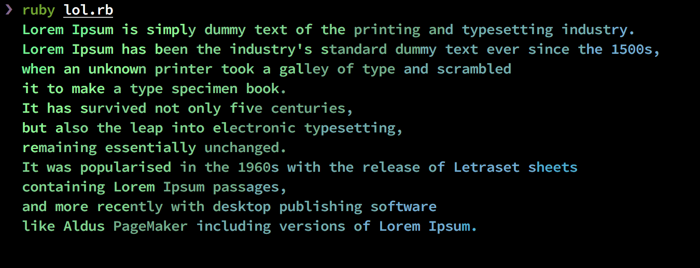

# Lolruby

[lolgopher](https://github.com/kris-nova/lolgopher) for Ruby.

NOTE: Go environment is required because this gem depends on golang extensions.



## Installation

Add this line to your application's Gemfile:

```ruby
gem 'lolruby'
```

And then execute:

    $ bundle

Or install it yourself as:

    $ gem install lolruby

## Usage

```ruby
require 'lolruby'

lorem = <<EOL
  Lorem Ipsum is simply dummy text of the printing and typesetting industry.
  Lorem Ipsum has been the industry's standard dummy text ever since the 1500s,
  when an unknown printer took a galley of type and scrambled
  it to make a type specimen book.
  It has survived not only five centuries,
  but also the leap into electronic typesetting,
  remaining essentially unchanged.
  It was popularised in the 1960s with the release of Letraset sheets
  containing Lorem Ipsum passages,
  and more recently with desktop publishing software
  like Aldus PageMaker including versions of Lorem Ipsum.
EOL

Lol.puts lorem
```

## Development

After checking out the repo, run `bin/setup` to install dependencies. Then, run `rake spec` to run the tests. You can also run `bin/console` for an interactive prompt that will allow you to experiment.

To install this gem onto your local machine, run `bundle exec rake install`. To release a new version, update the version number in `version.rb`, and then run `bundle exec rake release`, which will create a git tag for the version, push git commits and tags, and push the `.gem` file to [rubygems.org](https://rubygems.org).

## Contributing

Bug reports and pull requests are welcome on GitHub at https://github.com/[USERNAME]/lolruby.
